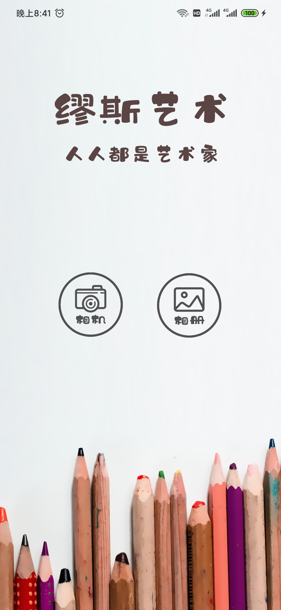
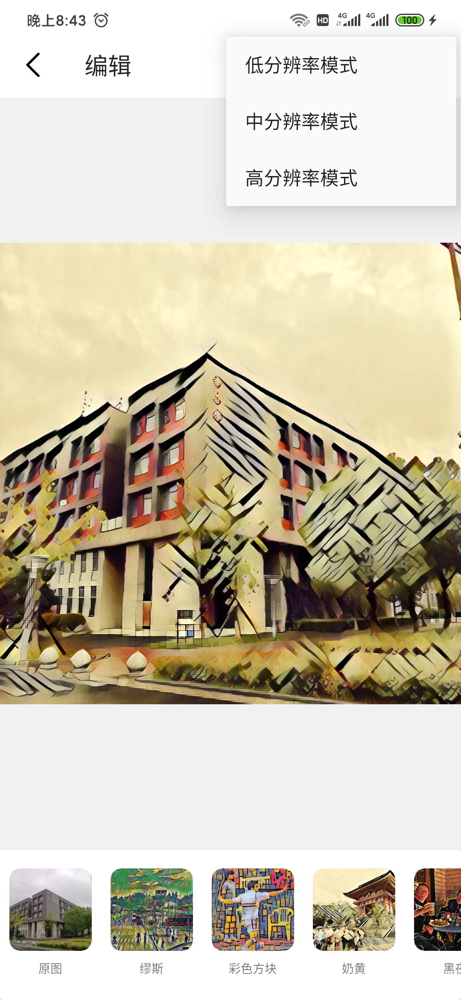

# Introduction
MusesArt is an Android demonstration application for paper "Block Shuffle: A Method for High-resolution Fast Style Transfer with Limited Memory". It is built on OpenCV and Xiaomi's MACE. You can download the source code and compile it with Android Studio, or install the package we published.

# User Interface

| Home Page                                                    | Edit Page |                                                              |
| ------------------------------------------------------------ | --------- | ------------------------------------------------------------ |
|                                          |           |                                          |
| This is the home page. The left bottom is "camera", and the right bottom is "album". You can enter the edit page from these two different bottom. |           | This is the edit page. You can apply a filter to stylize your photo. In the upper right corner you can select the resolution. "低", "中", "高" mean $1000\times 1000$, $2000\times 2000$, and $3000 \times 3000$. |

